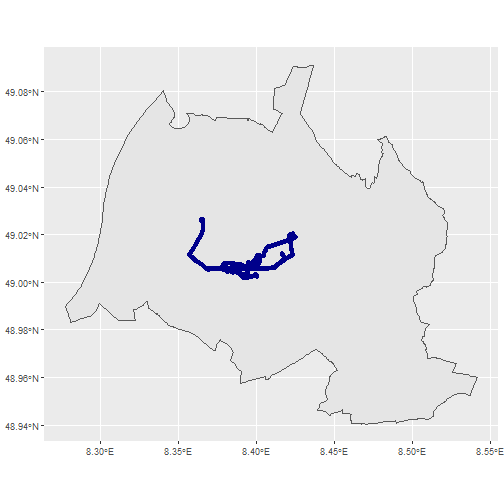

```r
##1. Packages

## Default repository
local({r <- getOption("repos")
r["CRAN"] <- "http://cran.r-project.org" 
options(repos=r)
})

## Define function check_pkg to tests if package is already installed and hence 
#only needs loading
check_pkg <- function(x)
{
  if (!require(x,character.only = TRUE))
  {
    install.packages(x,dep=TRUE)
    if(!require(x,character.only = TRUE)) stop("Package not found")
  }
}

## Call check_pkg()
check_pkg("pacman")
check_pkg("dplyr")
check_pkg("ggplot2")
check_pkg("readr")
check_pkg("tidyr")
check_pkg("sf")
check_pkg("terra")
check_pkg("tmap")
check_pkg("zoo")
check_pkg("units")
check_pkg("plotly")
check_pkg("patchwork")
check_pkg("gitcreds")
check_pkg("lubridate")
check_pkg("readr")
check_pkg("forcats")
check_pkg("osmdata")
check_pkg("OpenStreetMap")
check_pkg("ggmap")
check_pkg("osmextract")
check_pkg("sfnetworks")

##Trajectory data

#Read data

#We have access to two datasets, a small and a large one. As long as there are 
#sufficient routes in the smaller dataset, we will work with this one.
 
# Small dataset
data <- read_delim("data/combined_data.csv", ",") |>
  st_as_sf(coords = c("longitude", "latitude"), crs = 4326, remove = FALSE) 
```

```
## Rows: 21458 Columns: 4
## ── Column specification ────────────────────────────────────────────────────────────────────────────────
## Delimiter: ","
## dbl  (3): latitude, longitude, elevation
## dttm (1): timestamp
## 
## ℹ Use `spec()` to retrieve the full column specification for this data.
## ℹ Specify the column types or set `show_col_types = FALSE` to quiet this message.
```

```r
# Big dataset
data_1 <- read_delim("data/combined_data_1.csv", ",") |>
  st_as_sf(coords = c("longitude", "latitude"), crs = 4326, remove = FALSE)
```

```
## Rows: 347555 Columns: 4
## ── Column specification ────────────────────────────────────────────────────────────────────────────────
## Delimiter: ","
## dbl  (3): latitude, longitude, elevation
## dttm (1): timestamp
## 
## ℹ Use `spec()` to retrieve the full column specification for this data.
## ℹ Specify the column types or set `show_col_types = FALSE` to quiet this message.
```

```r
##2. Separate timestamp into date and time

# Convert the timestamp to POSIXct
data$timestamp <- ymd_hms(data$timestamp)

# Extract date component
data$date <- as.Date(data$timestamp)

# Extract time component
data$time <- format(data$timestamp, format = "%H:%M:%S")

# View the modified dataset
head(data)
```

```
## Simple feature collection with 6 features and 6 fields
## Geometry type: POINT
## Dimension:     XY
## Bounding box:  xmin: 8.369448 ymin: 49.0053 xmax: 8.369607 ymax: 49.00543
## Geodetic CRS:  WGS 84
## # A tibble: 6 × 7
##   latitude longitude elevation timestamp                      geometry date       time    
##      <dbl>     <dbl>     <dbl> <dttm>                      <POINT [°]> <date>     <chr>   
## 1     49.0      8.37      118. 2024-04-05 20:59:08 (8.369448 49.00543) 2024-04-05 20:59:08
## 2     49.0      8.37      118. 2024-04-05 20:59:34 (8.369605 49.00534) 2024-04-05 20:59:34
## 3     49.0      8.37      118. 2024-04-05 20:59:35 (8.369605 49.00533) 2024-04-05 20:59:35
## 4     49.0      8.37      118. 2024-04-05 20:59:36 (8.369606 49.00532) 2024-04-05 20:59:36
## 5     49.0      8.37      118. 2024-04-05 20:59:37  (8.369607 49.0053) 2024-04-05 20:59:37
## 6     49.0      8.37      118. 2024-04-05 20:59:38  (8.369607 49.0053) 2024-04-05 20:59:38
```

```r
##3. Select data within Karlsruhe

#In order to reduce the data set in a first step, we have filtered the data that
#lies within the border of Karlsruhe.

# Extract boundary of Karlsruhe
boundary <- getbb(place_name = "Karlsruhe") %>%
  opq() %>%
  add_osm_feature(key = "boundary",
                  value = "administrative") %>%
  osmdata_sf() %>%
  .$osm_multipolygons %>%
  filter(name == "Karlsruhe")

# Select data that is within this boundary
data <- st_filter(data, boundary)

# Plot
ggplot() +
  geom_sf(data = boundary) +
  geom_sf(data = data, color = "darkblue")
```



```r
#Occasionally, we encountered issues with a general Overpass server error when 
#attempting to access this data. To address this problem, we stored the boundary
#data locally on our computers, ensuring continuous access to this data at any 
#time.

#boundary <- st_read("data/boundary.gpkg")
#data <- st_read("data/small_data.gpkg")

#ggplot() +
geom_sf(data = boundary) +
  geom_sf(data = data, color = "green")
```

```
## Error in geom_sf(data = boundary) + geom_sf(data = data, color = "green"): non-numeric argument to binary operator
```

```r
##4. Start and end point of the route

#The starting point for the outbound routes is Kriegsstraße 183, 76135 Karlsruhe,
#Germany. The coordinates of this point are stored in the variable home_point.

#The end point for the return routes is Klosterweg 28, 76131 Karlsruhe, Germany.
#The coordinates of this point are stored in the variable hadiko_point.

# Store start point
home_point <- st_point(c(8.36964749052686, 49.00535930123405)) %>% 
  st_sfc(crs = 4326)

# Store end point
hadiko_point <- st_point(c(8.4230360394263, 49.020260402061204)) %>% 
  st_sfc(crs = 4326)

##5. Extract route

#Separate the drives

# Calculate time differences between consecutive points in seconds
data <- data %>%
  arrange(timestamp) %>%  # Ensure data is sorted by time
  mutate(time_diff = c(NA, diff(timestamp)))

# Identify where the time difference exceeds 300 seconds (5 minutes)
data <- data %>%
  mutate(new_drive = ifelse(is.na(time_diff) | time_diff > 300, 1, 0))

# Assign drive IDs
data <- data %>%
  mutate(drive_id = cumsum(new_drive))

# View the resulting data
print(data)
```

```
## Simple feature collection with 21458 features and 9 fields
## Geometry type: POINT
## Dimension:     XY
## Bounding box:  xmin: 8.356791 ymin: 49.00144 xmax: 8.425648 ymax: 49.02645
## Geodetic CRS:  WGS 84
## # A tibble: 21,458 × 10
##    latitude longitude elevation timestamp                      geometry date       time     time_diff
##  *    <dbl>     <dbl>     <dbl> <dttm>                      <POINT [°]> <date>     <chr>        <dbl>
##  1     49.0      8.37      118. 2024-04-05 20:59:08 (8.369448 49.00543) 2024-04-05 20:59:08        NA
##  2     49.0      8.37      118. 2024-04-05 20:59:34 (8.369605 49.00534) 2024-04-05 20:59:34        26
##  3     49.0      8.37      118. 2024-04-05 20:59:35 (8.369605 49.00533) 2024-04-05 20:59:35         1
##  4     49.0      8.37      118. 2024-04-05 20:59:36 (8.369606 49.00532) 2024-04-05 20:59:36         1
##  5     49.0      8.37      118. 2024-04-05 20:59:37  (8.369607 49.0053) 2024-04-05 20:59:37         1
##  6     49.0      8.37      118. 2024-04-05 20:59:38  (8.369607 49.0053) 2024-04-05 20:59:38         1
##  7     49.0      8.37      118. 2024-04-05 20:59:39  (8.369602 49.0053) 2024-04-05 20:59:39         1
##  8     49.0      8.37      118. 2024-04-05 20:59:40 (8.369611 49.00529) 2024-04-05 20:59:40         1
##  9     49.0      8.37      118. 2024-04-05 20:59:41 (8.369583 49.00525) 2024-04-05 20:59:41         1
## 10     49.0      8.37      118. 2024-04-05 20:59:42 (8.369589 49.00527) 2024-04-05 20:59:42         1
## # ℹ 21,448 more rows
## # ℹ 2 more variables: new_drive <dbl>, drive_id <dbl>
```

```r
#Filter the drives that happened between "home" and "hadiko", separate them into
#datasets with ways "home to hadiko" and "hadiko to home", visualize.

## Create function to filter drives
filter_drives <- function(start_point, start_distance, end_point, end_distance, data) {
  
  # Create the buffer around the start/end point
  start_buffer <- st_buffer(start_point, dist = start_distance)
  end_buffer <- st_buffer(end_point, dist = end_distance)
  
  # Check if the first point of each drive is within the start buffer
  first_points_within_start_buffer <- data %>%
    group_by(drive_id) %>%
    slice(1) %>%
    filter(st_within(geom, start_buffer, sparse = FALSE)) %>%
    pull(drive_id)
  
  # Check if the last point of each drive is within the end buffer
  last_points_within_end_buffer <- data %>%
    group_by(drive_id) %>%
    slice(n()) %>%
    filter(st_within(geom, end_buffer, sparse = FALSE)) %>%
    pull(drive_id)
  
  # Filter the original data to keep only rows with drive_id meeting both conditions
  valid_drive_ids <- intersect(first_points_within_start_buffer, last_points_within_end_buffer)
  data_start_end <- data %>%
    filter(drive_id %in% valid_drive_ids)
  print(valid_drive_ids)
  
  # Extract starting points for visualization
  starting_points <- data_start_end %>%
    group_by(drive_id) %>%
    slice(1) %>%
    ungroup()
  # Extract ending points for visualization
  ending_points <- data_start_end %>%
    group_by(drive_id) %>%
    slice(n()) %>%
    ungroup()
  # Visualize the starting/ending points and the start/end buffer as a ring
  plot <- ggplot() +
    geom_sf(data = data_start_end, aes(geometry = geom, colour = drive_id), alpha = 0.5, size = 0.1) +
    geom_sf(data = starting_points, aes(geometry = geom), color = "red", size = 1) +
    geom_sf(data = ending_points, aes(geometry = geom), color = "green", size = 1) +
    geom_sf(data = start_buffer, fill = NA, color = "red", size = 1, linetype = "dashed") +
    geom_sf(data = end_buffer, fill = NA, color = "green", size = 1, linetype = "dashed") +
    coord_sf() +
    theme_minimal() +
    labs(title = "Starting and Ending Points and Start/End Buffer Ring",
         subtitle = "Red points are the starting points, red dashed line is the start buffer ring, the same in green for end. Each drive has own colour")
  print(plot)
  return(data_start_end)
  
}
## Apply function
# on drives starting from home
data_from_home <- filter_drives(home_point, 500, hadiko_point, 500, data)
```

```
## Error in `stopifnot()`:
## ℹ In argument: `st_within(geom, start_buffer, sparse = FALSE)`.
## ℹ In group 1: `drive_id = 1`.
## Caused by error in `UseMethod()`:
## ! no applicable method for 'st_geometry' applied to an object of class "c('standardGeneric', 'genericFunction', 'function', 'OptionalFunction', 'PossibleMethod', 'optionalMethod')"
```

```r
# on drives starting from Hadiko
data_from_hadiko <- filter_drives(hadiko_point, 500, home_point, 500, data)
```

```
## Error in `stopifnot()`:
## ℹ In argument: `st_within(geom, start_buffer, sparse = FALSE)`.
## ℹ In group 1: `drive_id = 1`.
## Caused by error in `UseMethod()`:
## ! no applicable method for 'st_geometry' applied to an object of class "c('standardGeneric', 'genericFunction', 'function', 'OptionalFunction', 'PossibleMethod', 'optionalMethod')"
```

```r
#To gain a better overview, we created a bounding box around the relevant data points.

## Create bounding box around data
bbox <- st_bbox(data_from_home) |> 
  st_as_sfc()
```

```
## Error in eval(expr, envir, enclos): object 'data_from_home' not found
```

```r
#Using group by, we obtained an overview of how many routes there are.

## Group the data by drive_id
# Data from Home
group_data_from_home <- data_from_home %>%
  group_by(drive_id) %>%
  summarize(
    min_timestamp = min(timestamp),
    max_timestamp = max(timestamp)
  )
```

```
## Error in eval(expr, envir, enclos): object 'data_from_home' not found
```

```r
# Print
print(group_data_from_home)
```

```
## Error in eval(expr, envir, enclos): object 'group_data_from_home' not found
```

```r
# Data from Hadiko
group_data_from_hadiko <- data_from_hadiko %>%
  group_by(drive_id) %>%
  summarize(
    min_timestamp = min(timestamp),
    max_timestamp = max(timestamp)
  )
```

```
## Error in eval(expr, envir, enclos): object 'data_from_hadiko' not found
```

```r
# Print
print(group_data_from_hadiko)
```

```
## Error in eval(expr, envir, enclos): object 'group_data_from_hadiko' not found
```

```r
##6. Environmental Features OSM

#To relate the data to the environment, we used OpenStreetMap data. With the two
#functions below, we obtained an overview of the available data.

## Explore features
#available_features()

#available_tags(feature = "highway")

##7.Create Street Network

#By extracting the highways, we created a street network for our bounding box.
#{r fig.width=50, fig.height=40}
# Extract highways
highway <- getbb(place_name = "Karlsruhe") %>%
  opq() %>%
  add_osm_feature(key = "highway") %>%
  osmdata_sf() %>%
  .$osm_lines 

# Convert object to sfnetwork object
street_network <- as_sfnetwork(highway, directed = FALSE) %>% # set as undirected
  st_intersection(bbox)
```

```
## Error: object 'bbox' not found
```

```r
# Overview
street_network
```

```
## Error in eval(expr, envir, enclos): object 'street_network' not found
```

```r
# Plot
ggplot() +
  geom_sf(data = street_network %>% activate(edges) %>% st_as_sf(), aes(color = highway), size = 3) + 
  geom_sf(data = street_network %>% activate(nodes) %>% st_as_sf()) +
  theme_void()
```

```
## Error in eval(expr, envir, enclos): object 'street_network' not found
```

```r
#We stored the nearest vertices to the start and endpoint of the routes.

# Coordinates of all nodes in the network
vertices_sf <- street_network %>%
  activate(nodes) %>%
  st_as_sf()
```

```
## Error in eval(expr, envir, enclos): object 'street_network' not found
```

```r
# Find the id of the vertex closest to start point
start_vertex <- st_nearest_feature(home_point, vertices_sf)
```

```
## Error in eval(expr, envir, enclos): object 'vertices_sf' not found
```

```r
# Find the id of the vertex closest to end point
end_vertex <- st_nearest_feature(hadiko_point, vertices_sf)
```

```
## Error in eval(expr, envir, enclos): object 'vertices_sf' not found
```

```r
# Print
cat("Start Vertex:", start_vertex, "\n")
```

```
## Error in eval(expr, envir, enclos): object 'start_vertex' not found
```

```r
cat("End Vertex:", end_vertex)
```

```
## Error in eval(expr, envir, enclos): object 'end_vertex' not found
```

```r
##8. Green spaces

#To determine the green spaces in the area, parks and forests were extracted 
#from OSM data. Since OSM polygons and multipolygons provided different data, 
#both were extracted and then merged.

# Parks
parks <- getbb(place_name = "Karlsruhe") %>%
  opq() %>%
  add_osm_feature(key = "leisure",
                  value = "park") %>%
  osmdata_sf() %>%
  .$osm_polygons %>%
  st_intersection(bbox)
```

```
## Error: object 'bbox' not found
```

```r
# Forests Polygons
forest_polys <- getbb(place_name = "Karlsruhe") %>%
  opq() %>%
  add_osm_feature(key = "landuse",
                  value = "forest") %>%
  osmdata_sf() %>%
  .$osm_polygons %>%
  st_intersection(bbox)
```

```
## Error: object 'bbox' not found
```

```r
# Forests Multipolygons
forest_multipolys <- getbb(place_name = "Karlsruhe") %>%
  opq() %>%
  add_osm_feature(key = "landuse",
                  value = "forest") %>%
  osmdata_sf() %>%
  .$osm_multipolygons %>%
  st_make_valid() %>% 
  st_intersection(bbox)
```

```
## Error: object 'bbox' not found
```

```r
# Merge
green_spaces <- bind_rows(parks, forest_polys, forest_multipolys) |> 
  st_union() |> 
  st_make_valid()
```

```
## Error in eval(expr, envir, enclos): object 'parks' not found
```

```r
#As the grass polygons mostly intersect with the green space polygons and few 
#data points pass through them, as we can see in the visualization below, we 
#decided not to take this feature into account. We believe the green areas are 
#well covered by the forest and park extractions, so the grass does not need to 
#be considered.

# Trees
trees <- getbb(place_name = "Karlsruhe") %>%
  opq() %>%
  add_osm_feature(key = "natural",
                  value = "tree") %>%
  osmdata_sf() %>%
  .$osm_points %>%
  st_intersection(bbox)
```

```
## Error: object 'bbox' not found
```

```r
# Grass
grass <- getbb(place_name = "Karlsruhe") %>%
  opq() %>%
  add_osm_feature(key = "landuse",
                  value = "grass") %>%
  osmdata_sf() %>%
  .$osm_polygons %>%
  st_intersection(bbox)
```

```
## Error: object 'bbox' not found
```

```r
##9.Visualization of OSM Features

#To obtain a good overview of the extracted features, we visualized them.

#{r fig.width=50, fig.height=40}
# Plot
ggplot() +
  
  # Edges of street network
  geom_sf(data = street_network %>% activate(edges) %>% st_as_sf(), size = 2, color = "black") +
  
  # Green Spaces
  geom_sf(data = forest_multipolys, fill = "lightgreen") +
  
  # Trees
  geom_sf(data = trees, color = "darkgreen", size = 3) +
  
  # Grass
  geom_sf(data = grass, fill = "green") +
  
  # Movement data
  geom_sf(data = data_from_home, color = "steelblue", size = 1) +
  geom_sf(data = data_from_hadiko, color = "darkred", size = 1) +
  
  # Theme
  theme_void()
```

```
## Error in eval(expr, envir, enclos): object 'street_network' not found
```

